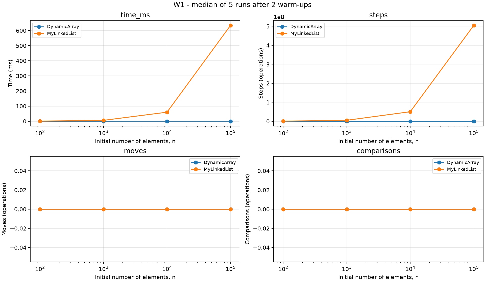
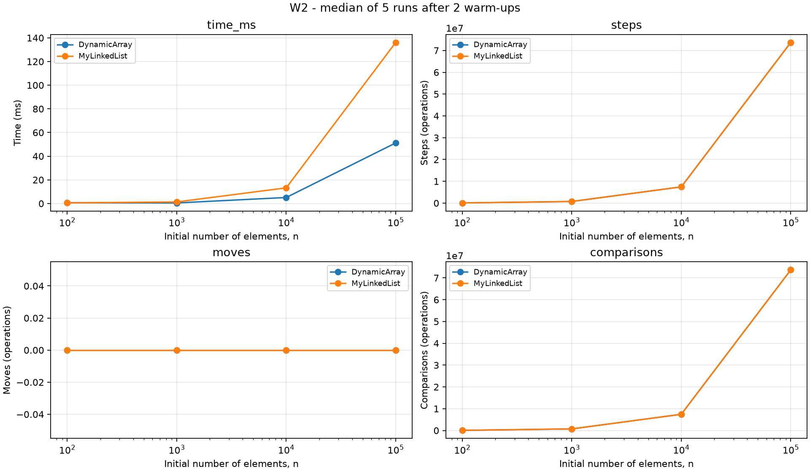
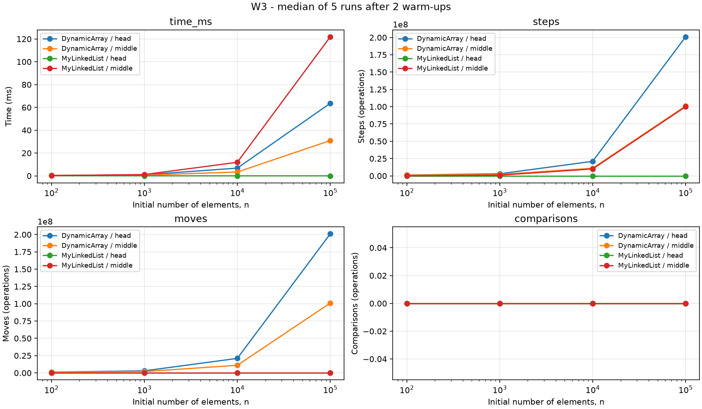
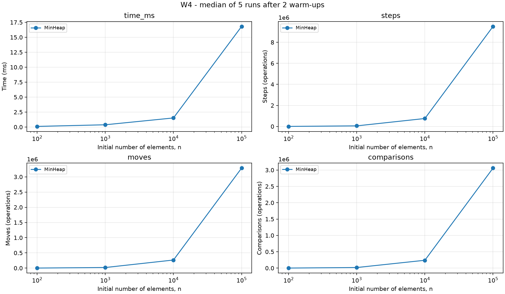

# Assignment 2 - Data Structures

Artem Khloptsev, SE-2525 | 4 October 2026

## 1. Implementation and measurement method

DynamicArray and MyLinkedList implement IntSequence, allowing the same workload code to operate on both structures. DynamicArray stores primitive values in an int array and doubles its initial capacity of eight when full. MyLinkedList is singly linked, with head, tail and size fields; each node stores one primitive int and one next reference. MinHeap is an array-based binary minimum heap. Both array structures retain capacity after removal. Index checks happen before mutation; invalid indices throw IndexOutOfBoundsException, and empty heap access throws IllegalStateException. There are no standard collections inside the implementations.

Measurements were taken on Windows with Oracle Java 25.0.1, targeting Java 17 bytecode, through IntelliJ's bundled Maven. They describe this execution environment and are not portable absolute timings. Every size uses new Random(42), and both sequences receive identical data, index requests and search requests. For each case, two warm-up runs are discarded and five independent runs are measured. Each run constructs a fresh structure. The median-time record supplies the time and counters in CSV, and repeatability checks require identical counters and checksums across the five runs. Timing uses System.nanoTime.

W1 performs 10,000 random get operations; W2 performs 1,000 searches, alternating 500 present and 500 guaranteed absent values. Data are nonnegative, while absent queries are negative. W3 performs 1,000 insertions followed by 1,000 removals, at index zero or the fixed initial n/2. W4 inserts n values and extracts n minima. Initial filling for W1-W3, query generation and correctness validation are outside timing. W4 includes storing extracted values into a preallocated output array, but not its allocation or validation. All remaining sequence values are checked after timing, and heap output is checked for sorted order and checksum. Unit tests compare complete results with standard collections.

Counters are part of the timed implementations. A step is an actual array-cell read or following a list next reference, including the final next link to null. A move is relocation of an existing array element, including copies during growth and two writes during a swap, or an update of a structural list reference (head, tail, next). Initial insertion of a new array value is not a shift. Local reference-variable assignments and default null initialization are not structural link updates. Comparisons count comparisons of element values, not index bounds, loop conditions or reference identity. Test-only isValidHeap inspection does not alter counters. This convention means list get(0) has zero traversal steps, while array get(0) has one cell-read step; the metrics do not claim to count every CPU instruction.

## 2. Complexity analysis

Let n be the size before an operation, i its index, k = n-i for insertion and k = n-i-1 for removal. Average indexed bounds assume a uniformly chosen valid index. Average search assumes a mixture of absent searches and uniformly distributed matching positions. Heap average bounds depend on key distribution, so a safe upper bound is stated where no tight average model is established. Auxiliary space excludes retained storage unless stated. The structures themselves occupy Theta(n) space: arrays keep capacity below approximately twice their historical maximum size, while the list keeps n node objects.

| Structure / operation | Best | Average | Worst | Auxiliary space | Justification |
|---|---|---|---|---|---|
| Array add(x) | Theta(1) | Theta(1) amortized over appends | Theta(n) | Theta(1); Theta(n) during growth | Most appends write one slot; geometric growth copies n elements occasionally. |
| Array add(i,x) | Theta(1) | Theta(n) for uniform i | Theta(n) | Theta(1); Theta(n) during growth | Theta(k+1) without growth; a full array adds Theta(n) copying. |
| Array remove(i) | Theta(1) | Theta(n) | Theta(n) | Theta(1) | Shifts k remaining values; removal at the last index shifts none. |
| Array get(i) | Theta(1) | Theta(1) | Theta(1) | Theta(1) | One direct indexed read after bounds checking. |
| Array contains(x) | Theta(1) | Theta(n) | Theta(n) | Theta(1) | Stops at the first match or scans the entire sequence. |
| List add(x) | Theta(1) | Theta(1) | Theta(1) | Theta(1) | Tail gives direct append access; one node is allocated. |
| List add(i,x) | Theta(1) | Theta(n) | Theta(n) | Theta(1) | Head and tail insertions are constant; an interior insertion traverses to its predecessor. |
| List remove(i) | Theta(1) | Theta(n) | Theta(n) | Theta(1) | Head removal is constant; other indices require predecessor traversal. |
| List get(i) | Theta(1) | Theta(n) | Theta(n) | Theta(1) | Theta(i+1) execution time despite exactly i counted next-link steps. |
| List contains(x) | Theta(1) | Theta(n) | Theta(n) | Theta(1) | Visits values sequentially until a match or null. |
| Heap insert(x) | Theta(1) | O(log n) amortized upper bound | Theta(n) with growth; Theta(log n) otherwise | Theta(1); Theta(n) during growth | Bubble-up follows heap height; a resize copies the backing array. |
| Heap peekMin() | Theta(1) | Theta(1) | Theta(1) | Theta(1) | Minimum is at index zero. |
| Heap extractMin() | Theta(1) | O(log n) | Theta(log n) | Theta(1) | A singleton or equal keys can terminate immediately; worst case descends the heap height. |

Theta supplies matching O and Omega bounds. The two heap average O bounds do not assert a tight lower bound; Omega(1) holds. Geometric growth costs form a geometric series, which explains constant amortized append cost. Array shrinking is absent, so after deletions retained array space is bounded by historical capacity rather than current n alone. Space complexity abstracts allocator and garbage-collector behavior; exact byte footprints were not measured.

## 3. Loop invariant proofs

### DynamicArray.contains

**Invariant.** Before iteration i, 0 <= i <= size and no element of data[0..i) equals the requested value. The array and size remain unchanged.

**Initialization.** i starts at zero. The already examined prefix is empty, so the statement holds vacuously.

**Maintenance.** The loop reads data[i] and compares it with the value. If equal, returning true is justified by a witnessed matching element. Otherwise the prefix through i contains no match, and incrementing i preserves the invariant for the next iteration.

**Termination.** If the loop finishes normally, i equals size. The invariant then covers every stored element, so returning false is correct. Early termination returns true only after observing an actual match.

**Conclusion.** Both possible exit paths match the meaning of contains. The empty case also returns false correctly without entering the loop.

### DynamicArray.remove - left-shift loop

Let A denote the array contents before removal and N its original size. Let p be the valid removal index. A is a mathematical snapshot used in the proof, not an extra runtime array.

**Invariant.** Before iteration i, p <= i <= N-1; positions below p are unchanged; for every p <= j < i, data[j] = A[j+1]; and for every i <= j < N, data[j] = A[j]. size remains N during the loop, and removed equals A[p].

**Initialization.** i starts at p. The shifted segment is empty, and all original cells still equal A. The removed value was read before the loop.

**Maintenance.** While i < N-1, the source data[i+1] still equals A[i+1] by the untouched-suffix property. Assigning it to data[i] extends the correct shifted segment by one position and leaves the subsequent suffix unchanged. Incrementing i establishes the next invariant.

**Termination.** At i = N-1, every destination p through N-2 equals its original successor. Decrementing size hides the last cell, leaving the original prefix followed by the original suffix with exactly A[p] removed.

**Conclusion.** The returned value is the removed element, and the retained sequence has the correct order and length. Removing the last element requires no shift, and removing the sole element leaves size zero.

## 4. Results and plots

The complete CSV contains all 36 required combinations, with the specified eight columns. The following table shows n = 100,000; plots also include the other three sizes.

| Workload | Variant | Structure | Median ms | Steps | Moves | Comparisons |
|---|---|---|---:|---:|---:|---:|
| W1 | - | DynamicArray | 0.032399 | 10000 | 0 | 0 |
| W2 | - | DynamicArray | 51.205400 | 73682044 | 0 | 73682044 |
| W3 | head | DynamicArray | 63.584401 | 201000000 | 200999000 | 0 |
| W3 | middle | DynamicArray | 30.934000 | 101000000 | 100999000 | 0 |
| W1 | - | MyLinkedList | 634.289500 | 504930938 | 0 | 0 |
| W2 | - | MyLinkedList | 136.115599 | 73681544 | 0 | 73682044 |
| W3 | head | MyLinkedList | 0.010200 | 1000 | 3000 | 0 |
| W3 | middle | MyLinkedList | 121.881100 | 100001000 | 3000 | 0 |
| W4 | - | MinHeap | 16.809500 | 9505673 | 3287423 | 3059125 |

Each figure contains time and three counter panels. The horizontal axis uses a logarithmic n scale; vertical axes remain linear, preserving visible zero counters. W3 distinguishes head and middle for both structures, while W4 contains only the heap as required. Tiny timings and small-n changes are susceptible to residual JIT compilation, timer overhead, CPU scheduling and frequency changes. Two warm-ups meet the chosen protocol but do not establish full JVM steady state; decreasing small timings are reported honestly rather than edited to fit theory.

## 5. Discussion (15 sentences)

DynamicArray accesses a value directly through its index, while MyLinkedList must follow preceding links.
The W1 counters confirm this difference: the array performs exactly 10,000 reads for every size, while list traversal grows with n.
At n = 100,000 the measured list access time is much larger than the array time, consistent with that traversal cost.
An int array stores neighbouring values consecutively, allowing one CPU cache line to serve several upcoming accesses.
The same spatial locality helps sequential search even though both contains implementations have linear worst-case complexity.
Linked nodes are separate objects, so consecutive logical values need not be close in memory.
Pointer chasing creates a dependency between loads because the address of the next node comes from the current node.
Node objects also have headers, alignment and references, increasing memory use beyond the four-byte value.
Allocating nodes can create garbage-collection work that affects timing even when allocation happens outside a measured workload.
The exact byte overhead was not measured here, so no numerical memory claim is made.
W3 head favours the list because it changes a constant number of links while the array shifts many elements.
W3 middle still requires the singly linked list to locate a predecessor, so its overall operation remains linear.
Equal Big-O therefore does not imply equal elapsed time, and the count definitions also omit hardware-level effects.
MyLinkedList is a useful choice for frequent boundary mutations, while DynamicArray is appropriate for indexed reads and compact traversal.
MinHeap is appropriate when jobs must be processed by minimum priority without sorting the entire remaining collection after each extraction.

## 6. Validation and scope

Maven clean test completed with 32 tests, no failures, errors or skips. Tests cover empty and singleton cases, duplicates, extreme int values, first/last indices, invalid inputs, growth, random comparisons against standard collections and exact counter examples. Heap property is checked after each operation in randomized and sorted-output tests. The full benchmark completed and its run-level checks passed. The plotting script validates the expected case set before generating figures. JOL memory measurement and Floyd bottom-up buildHeap are optional bonuses and are not implemented. No hardware cache counters were collected; locality explanations are architectural interpretations of measured behavior, not direct cache-miss measurements.
